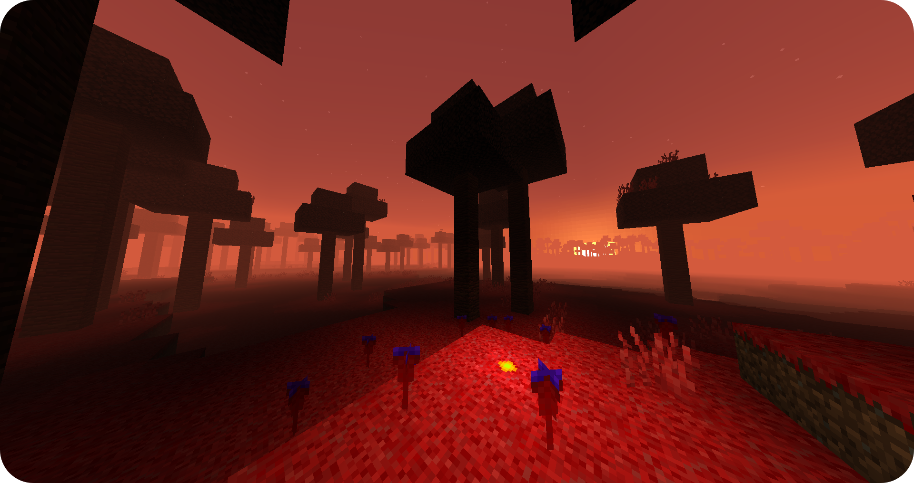
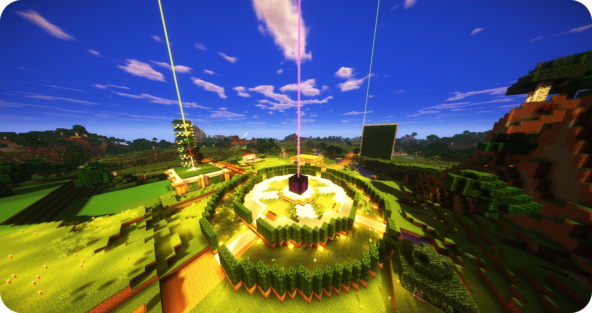
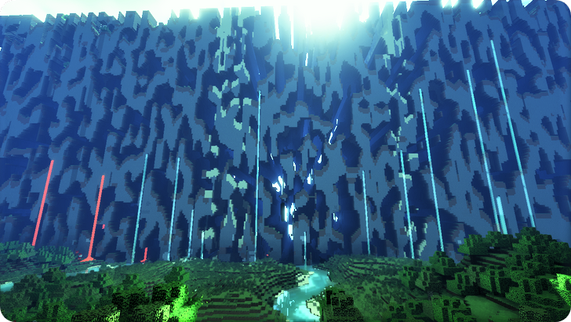

       Xairstone - Home   #Head{ height: 650px; background-image: url(lostcraft/img/banner.png); background-size: cover; background-repeat: no-repeat; text-align: center; position: relative; } #Head h1{ margin: 0; position: absolute; top: 50%; left: 50%; transform: translate(-50%, -50%); color: white; } #Head h1:hover{ margin: 0; position: absolute; top: 50%; left: 50%; transform: translate(-50%, -50%); color: rgb(170, 170, 170); } body{ background-color: rgb(20, 20, 20); } .info{ background-color: black; } .info h3{ color: white; text-align: center; padding-top: 60px; font-size: 40px; font-family: Arial, Helvetica, sans-serif; font-weight: bold; } .info p{ color: white; text-align: center; padding-top: 25px; font-family: Arial, Helvetica, sans-serif; font-weight: bold; font-size: 22px; } .info img{ padding-top: 20px; text-align:center; margin:auto; display:block; padding-bottom: 70px; } .info2{ background-color: white; } .info2 h3{ color: black; text-align: center; padding-top: 60px; font-size: 40px; font-family: Arial, Helvetica, sans-serif; font-weight: bold; } .info2 p{ color: black; text-align: center; padding-top: 25px; font-family: Arial, Helvetica, sans-serif; font-weight: bold; font-size: 22px; } .info2 img{ padding-top: 20px; text-align:center; margin:auto; display:block; padding-bottom: 70px; } .discover{ box-shadow: inset 0px 1px 0px 0px #ffffff; background: linear-gradient(to bottom, #f9f9f9 5%, #e9e9e9 100%); background-color: #f9f9f9; border-radius: 6px; border: 1px solid #dcdcdc; display: inline-block; cursor: pointer; color: #444444; font-family: Arial; font-size: 16px; font-weight: bold; padding: 6px 25px; text-decoration: none; text-shadow: 0px 1px 0px #ffffff; width: 150px; height: 45px; margin-left: 20px; margin-right: 20px; margin-bottom: 13px; } .discover:hover{ box-shadow: inset 0px 1px 0px 0px #ffffff; background: #dadada; background-color: #dadada; border-radius: 6px; border: 1px solid #dadada; display: inline-block; cursor: pointer; color: #444444; font-family: Arial; font-size: 16px; font-weight: bold; padding: 6px 24px; text-decoration: none; text-shadow: 0px 1px 0px #ffffff; width: 150px; height: 45px; margin-left: 20px; margin-right: 20px; margin-bottom: 13px; } .discover-div{ display: flex; align-items: center; justify-content: center; padding-bottom: 50px; } /\*\*\*\*\*\*\*\*\*\*\*\*\*\*\*\*\*\*\*\*\*\*\*\*\*\*\*\*\*\*/ /\* 01. Footer Design \*/ /\*\*\*\*\*\*\*\*\*\*\*\*\*\*\*\*\*\*\*\*\*\*\*\*\*\*\*\*\*\*/ .footer-clean { padding:50px 0; background-color:rgb(233, 233, 233); color:#707070; } h3 { margin-top:0; margin-bottom:12px; font-weight:bold; font-size:16px; color: inherit; text-align: center; } .footer-clean ul { padding:0; list-style:none; line-height:1.6; font-size:14px; margin-bottom:0; } .footer-clean ul a { color:inherit; text-decoration:none; opacity:0.8; } .footer-clean li { text-align: center; } .footer-clean ul a:hover { opacity:1; } .footer-clean .item.social { text-align:right; } @media (max-width:767px) { .footer-clean .item { text-align:center; padding-bottom:20px; } } @media (max-width: 768px) { .footer-clean .item.social { text-align:center; } } .footer-clean .item.social > a { font-size:24px; width:40px; height:40px; line-height:40px; display:inline-block; text-align:center; border-radius:50%; border:1px solid #ccc; margin-left:10px; margin-top:22px; color:inherit; opacity:0.75; } .footer-clean .item.social > a:hover { opacity:0.9; } @media (max-width:991px) { .footer-clean .item.social > a { margin-top:40px; } } @media (max-width:767px) { .footer-clean .item.social > a { margin-top:10px; } } .footer-clean .copyright { margin-top:14px; margin-bottom:0; font-size:13px; opacity:0.6; background-color: transparent; } /\*\*\*\*\*\*\*\*\*\*\*\*\*\*\*\*\*\*\*\*\*\*\*\*\*\*\*/ /\* 02. Scroll Bar \*/ /\*\*\*\*\*\*\*\*\*\*\*\*\*\*\*\*\*\*\*\*\*\*\*\*\*\*\*/ ::-webkit-scrollbar { width: 10px; background-color: #1a1a1a; } ::-webkit-scrollbar-thumb { background-color: #1d1d1d; } ::-webkit-scrollbar-track { background-color: #000000; } /\*\*\*\*\*\*\*\*\*\*\*\*\*\*\*\*\*\*\*\*\*\*\*\*/ /\* 03. Nav Bar \*/ /\*\*\*\*\*\*\*\*\*\*\*\*\*\*\*\*\*\*\*\*\*\*\*\*/ /\*\*\*\*\*\*\*\*\*\*\*\*\*\*\*\*\*\*\*\*\*\*\*\*\*\*/ /\* 01. Navigation \*/ /\*\*\*\*\*\*\*\*\*\*\*\*\*\*\*\*\*\*\*\*\*\*\*\*\*\*/ .navbar-custom { background-color: #000000; box-shadow: 0 0.0625rem 0.375rem 0 rgba(0, 0, 0, 0.1); transition: all 0.2s; font-size: 15px; font-family: Arial, Helvetica, sans-serif; font-weight: 750; } .navbar-custom .navbar-brand.logo-image img { width: 113px; height: 34px; margin-bottom: 1px; -webkit-backface-visibility: hidden; } .navbar-custom .navbar-brand.logo-text { font: 700 2.375rem/1.5rem "Montserrat", sans-serif; color: #fff; letter-spacing: -0.5px; text-decoration: none; } .navbar-custom .navbar-nav { margin-top: 0.75rem; } .navbar-custom .nav-item .nav-link { padding: 0 0.75rem 0 0.75rem; color: #fff; text-decoration: none; transition: all 0.2s ease; } .navbar-custom .nav-item .nav-link:hover, .navbar-custom .nav-item .nav-link.active { color: #cacaca; } /\* Dropdown Menu \*/ .navbar-custom .dropdown:hover > .dropdown-menu { display: block; /\* this makes the dropdown menu stay open while hovering it \*/ min-width: auto; animation: fadeDropdown 0.2s; /\* required for the fade animation \*/ } @keyframes fadeDropdown { 0% { opacity: 0; } 100% { opacity: 1; } } .navbar-custom .dropdown-toggle:focus { /\* removes dropdown outline on focus \*/ outline: 0; } .navbar-custom .dropdown-menu { margin-top: 0; border: none; border-radius: 0.25rem; background-color: #4633af; } .navbar-custom .dropdown-item { color: #fff; text-decoration: none; } .navbar-custom .dropdown-item:hover { background-color: #4633af; } .navbar-custom .dropdown-item .item-text { font: 700 0.75rem/1.5rem "Montserrat", sans-serif; } .navbar-custom .dropdown-item:hover .item-text { color: #cacaca; } .navbar-custom .dropdown-items-divide-hr { width: 100%; height: 1px; margin: 0.25rem auto 0.25rem auto; border: none; background-color: #b5bcc4; opacity: 0.2; } /\* end of dropdown menu \*/ .navbar-custom .social-icons { display: none; } .navbar-custom .navbar-toggler { border: none; color: #fff; font-size: 2rem; } .navbar-custom button\[aria-expanded='false'\] .navbar-toggler-awesome.fas.fa-times{ display: none; } .navbar-custom button\[aria-expanded='false'\] .navbar-toggler-awesome.fas.fa-bars{ display: inline-block; } .navbar-custom button\[aria-expanded='true'\] .navbar-toggler-awesome.fas.fa-bars{ display: none; } .navbar-custom button\[aria-expanded='true'\] .navbar-toggler-awesome.fas.fa-times{ display: inline-block; margin-right: 0.125rem; } /\*\*\*\*\*\*\*\*\*\*\*\*\*\*\*\*\*\*\*\*\*\*\*\*\*\*\*\*\*/ /\* 02. Media Queries \*/ /\*\*\*\*\*\*\*\*\*\*\*\*\*\*\*\*\*\*\*\*\*\*\*\*\*\*\*\*\*/ /\* Min-width width 768px \*/ @media (min-width: 768px) { /\* General Styles \*/ .p-heading { width: 85%; margin-right: auto; margin-left: auto; } h1 { font: 700 3.25rem/3.75rem "Montserrat", sans-serif; } /\* end of general styles \*/ /\* Navigation \*/ .navbar-custom { padding: 2.125rem 1.5rem 2.125rem 2rem; box-shadow: none; background: transparent; } .navbar-custom .navbar-brand.logo-text { color: #fff; } .navbar-custom .navbar-nav { margin-top: 0; } .navbar-custom .nav-item .nav-link { padding: 0.25rem 0.75rem 0.25rem 0.75rem; color: #fff; } .navbar-custom .nav-item .nav-link:hover, .navbar-custom .nav-item .nav-link.active { color: #cacacadb; } .navbar-custom.top-nav-collapse { padding: 0.5rem 1.5rem 0.5rem 2rem; box-shadow: 0 0.0625rem 0.375rem 0 rgba(0, 0, 0, 0.1); background-color: #4633af; } .navbar-custom.top-nav-collapse .navbar-brand.logo-text { color: #fff; } .navbar-custom.top-nav-collapse .nav-item .nav-link { color: #fff; } .navbar-custom.top-nav-collapse .nav-item .nav-link:hover, .navbar-custom.top-nav-collapse .nav-item .nav-link.active { color: #cacacadb; } .navbar-custom .dropdown-menu { box-shadow: 0 0.25rem 0.375rem 0 rgba(0, 0, 0, 0.03); } .navbar-custom .dropdown-item { padding-top: 0.25rem; padding-bottom: 0.25rem; } .navbar-custom .dropdown-items-divide-hr { width: 84%; } /\* end of navigation \*/ /\* Extra Pages \*/ .ex-header { padding-top: 11rem; padding-bottom: 9rem; } .ex-basic-2 .text-container.dark { padding: 2.5rem 3rem 2rem 3rem; } .ex-basic-2 .text-container.column { width: 90%; margin-right: auto; margin-left: auto; } /\* end of extra pages \*/ } /\* end of min-width width 768px \*/ /\* Min-width width 1200px \*/ @media (min-width: 1200px) { /\* Navigation \*/ .navbar-custom { padding: 2.125rem 5rem 2.125rem 5rem; } .navbar-custom.top-nav-collapse { padding: 0.5rem 5rem 0.5rem 5rem; } /\* end of navigation \*/ }  

 

*   [HOME](https://xairstone.com)
*   [BLOG](https://xairstone.com/server)
*   [MODS](https://xairstone.com/mods)
*   [PROJETS](https://xairstone.com/server)
*   [SERVEURS](https://xairstone.com/server)

[

Lostcraft
=========

](https://xairstone.com/mods/lostcraft)

### Bienvenue dans un monde cubique.

Oserez-vous explorer, découvrir et affronter les créatures les plus redoutables de Xairstone ?

### Entrez dans un nouveau monde.

Votre nouvelle vie vous attend, n'attendez plus et lancez-vous dans l'aventure.

### Les Far Lands, nos limites.

Aventurez-vous dans un monde infini, ou presque...

### Découvrez nos projets.

De nombreuses aventures vous attendent, ne perdez plus une seconde !

Mods Serveurs

### Découvrir

*   [Mods](https://xairmi.com/xidime)
*   [Projets](https://xairmi.com/hypee)
*   [Serveurs](https://xairmi.com/hypee)

### Actualité

*   [Blog](https://xairmi.com/discover)
*   [Discord](https://xairmi.com/privacy-policy)
*   [Discord Beta](https://xairmi.com/terms-of-use)

### Utile

*   [E-mail](mailto:contact@xairmi.com)
*   [Galerie](https://xairmi.com/support-us)
*   [Etat des services](https://xairmi.com/social-networks)

 